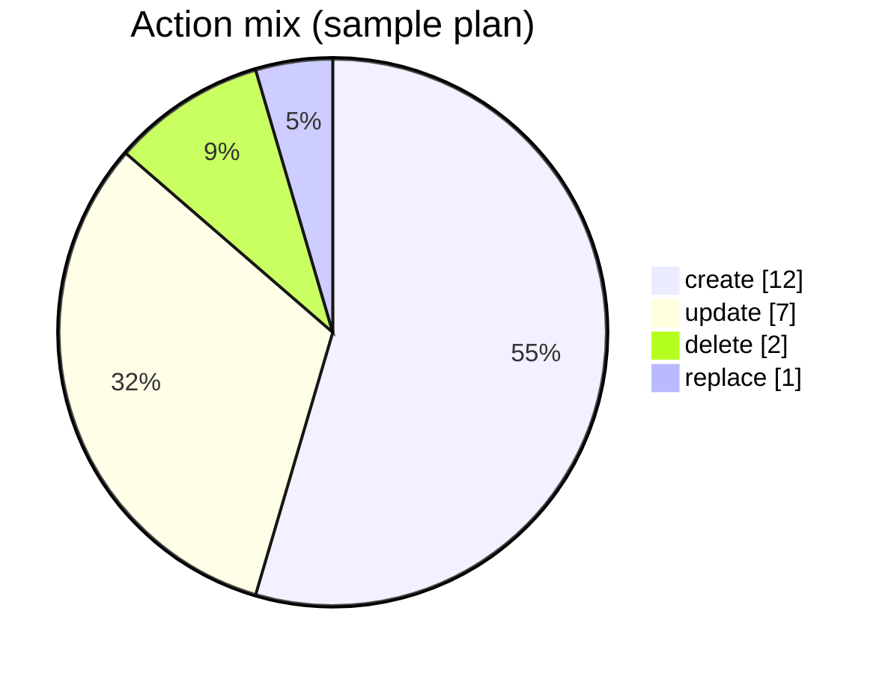

# tfreport

[](https://github.com/Jinssi/tfreport/actions/workflows/ci.yml)
[](https://pypi.org/project/tfreport/)
[](LICENSE)

A comprehensive Terraform plan, apply, and drift report generator. It turns `terraform show -json` and `terraform apply` output into a visualization-rich Markdown report (dashboards, dependency-graph blast radius, policy-body diffs, compliance checks, cost charts, run-to-run trends, rollback playbooks) and can also emit HTML, SARIF, Microsoft Teams, and Slack payloads. Reports are advisory by design and never fail your build.

Designed for Azure / AVM / ALZ environments but works on any provider.

## What it looks like

The report is plain Markdown so it renders inline in PRs, MR comments, and PR/MR job summaries. Every chart is either a Mermaid diagram, a Unicode sparkbar, or an emoji badge, so there are no images to fetch and nothing to break in offline runners. Below is a tiny live preview that GitHub renders inside this README:



For a full report rendered against a real fixture, see [examples/sample-report.md](examples/sample-report.md) and [examples/sample-report-avm.md](examples/sample-report-avm.md).

## Three ways to use it

| Shape | Best for | Install |
| --- | --- | --- |
| **GitHub reusable workflow** | GitHub Actions repos that want the full pipeline | `uses: Jinssi/tfreport/.github/workflows/terraform-plan.yml@v1` |
| **GitHub composite action** | GHA users with their own terraform steps | `uses: Jinssi/tfreport@v1` |
| **PyPI package (`tfreport`)** | Any other CI (Azure DevOps, GitLab, Jenkins, local) | `pip install tfreport` |

All three call the same engine. CLI flags are the source of truth; the composite action and reusable workflow expose a curated subset (see [Inputs and feature parity](#inputs-and-feature-parity) below).

## Quickstart, local

```bash
pip install tfreport
terraform plan -out=tfplan
terraform show -json tfplan > plan.json
tf-report-plan plan.json --out plan_summary.md --json-out plan_summary.json
```

Add `--ai` for an LLM reviewer narrative section (`LLM_BACKEND=github_models|azure_openai|none`).

For apply runs:

```bash
terraform apply -auto-approve tfplan 2>&1 | tee apply.log
tf-report-apply --log apply.log --plan-summary-json plan_summary.json --out apply_summary.md \
  --history reports/apply-history.jsonl
```

For drift detection (e.g. nightly `terraform plan` on `main`):

```bash
tf-report-drift plan.json --out drift_summary.md --history reports/drift-history.jsonl
```

## Quickstart, GitHub Actions reusable workflow

```yaml
# .github/workflows/terraform.yml in your consumer repo
name: Terraform
on:
  pull_request:
    paths: ["**/*.tf", "**/*.tfvars"]

jobs:
  plan:
    uses: Jinssi/tfreport/.github/workflows/terraform-plan.yml@v1
    with:
      working-directory: infra
      ai: true
```

You get: plan run, Markdown report, sticky PR comment, artifact, and job summary.

For apply on `main`:

```yaml
jobs:
  apply:
    uses: Jinssi/tfreport/.github/workflows/terraform-apply.yml@v1
    with:
      working-directory: infra
      environment: production
```

## Quickstart, GitHub Actions composite action

If you already have your own plan steps:

```yaml
- run: terraform plan -out=tfplan
- run: terraform show -json tfplan > plan.json

- uses: Jinssi/tfreport@v1
  with:
    mode: plan
    plan-json: plan.json
    ai: "true"
```

## Quickstart, Azure DevOps / GitLab / other CI

See [examples/azure-devops](examples/azure-devops/azure-pipelines.yml) and [examples/gitlab](examples/gitlab/.gitlab-ci.yml).

The pattern is always:

```bash
pip install tfreport
terraform show -json tfplan > plan.json
tf-report-plan plan.json --out plan_summary.md
```

## What the report contains

Plan reports (`tf-report-plan`) are layered for deployers approving real changes:

- **Dashboard**: action-mix Mermaid pie, risk-severity Mermaid bar, Unicode-bar impact heatmap, headline badge row.
- **Executive summary** with a **Module map** Mermaid flowchart colored by max severity per module.
- **Blast radius**: top destructive ops and the downstream resources they would impact, derived from a real dependency graph of `configuration.root_module` references and `depends_on`.
- **Policy changes**: for `azurerm_policy_*` and `azuread_conditional_access_policy`, decoded effect transitions (e.g. `Audit` to `Deny`), parameter deltas, and scope diffs. Tightening upgrades risk severity to **high**.
- **Compliance checks**: pluggable rule packs (required tags, naming regex, region allowlist, public-network flags, encryption-at-rest) with a pass/fail score.
- **Trend (last N runs)**: Unicode sparkbars for change count, risks, cost delta, and compliance score (with `--history PATH`).
- **Cost impact** (with `--cost-json`): Infracost monthly delta table plus a Mermaid bar chart of the top deltas.
- **Baseline delta** (with `--baseline`): stat delta and new HIGH risks vs a prior run.
- **Changes**: grouped by module, sorted replace > delete > update > create, with risk badge.
- **Risks**: advisory list ordered by severity (high, medium, low).
- **Suggested reviewers**: derived from `routing.rules` config (address or type globs map to reviewer handles).
- **Rollback playbook**: per destructive stateful change, pre-checks (snapshots, soft-delete, backup verification) and rollback steps.
- **Resource details**: per-resource changed attributes, replace causes, and before / after diff tables. Sensitive values are masked.
- **Tag-only updates** and **Ignored by config**, collapsed into `<details>` blocks.
- **Narrative** (optional): LLM reviewer guidance built from the deterministic summary, never from raw plan content.
- **Provenance footer**: Terraform version, tfreport version, timestamp, CI source.

Apply reports (`tf-report-apply`) add an apply dashboard, a planned-vs-applied table, a slowest-resources table, and a Mermaid `gantt` of the top 20 longest operations when the apply log contains duration markers.

### Output formats (CLI)

| Flag | Output |
| --- | --- |
| `--out plan.md` | Markdown (always) |
| `--json-out plan.json` | Structured `PlanSummary` JSON |
| `--html-out plan.html` | Self-contained HTML report (inline CSS, SVG charts, no network calls) |
| `--sarif-out plan.sarif` | SARIF 2.1.0, uploadable to GitHub Code Scanning |
| `--teams-out teams.json` | Microsoft Teams Adaptive Card v1.4 envelope (POST to an Incoming Webhook) |
| `--slack-out slack.json` | Slack Block Kit payload (POST to an Incoming Webhook) |
| `--report-link URL` | Embeds an "Open report" button into Teams/Slack payloads |
| `--history reports/plan-history.jsonl` | Append a snapshot and render `## Trend` |

### Config (`.tfreport.json` or `.tfreport.yml`)

`pip install tfreport[full]` to enable YAML configs.

```json
{
  "ignore": ["module.legacy.*"],
  "group_by_module": true,
  "demote_tag_only": true,
  "diff_details": true,
  "compliance": {
    "required_tags": ["owner", "costcenter", "env"],
    "allowed_regions": ["westeurope", "northeurope"],
    "naming": {"azurerm_storage_account": "^st[a-z0-9]{3,22}$"},
    "no_public_network": true,
    "encryption_required": true
  },
  "routing": {
    "rules": [
      {"glob": "module.network.*",           "reviewers": ["@team-netsec"]},
      {"type_glob": "azurerm_kubernetes_*",  "reviewers": ["@team-platform"]},
      {"glob": "*",                          "reviewers": ["@team-cloud"]}
    ]
  }
}
```

See [examples/.tfreport.yml](examples/.tfreport.yml) for the YAML form.

## Inputs and feature parity

Everything is reachable from the CLI. The composite action wires the most common flags. The new exporter and history flags are CLI-only today and will be added to the action in a follow-up.

| Capability | CLI | Composite action (`Jinssi/tfreport@v1`) |
| --- | --- | --- |
| Plan / apply / drift modes | yes | yes (`mode: plan|apply|drift`) |
| `--out`, `--json-out`, `--config`, `--baseline`, `--cost-json`, `--heading` | yes | yes |
| `--ai`, `--ai-backend` | yes | yes (`ai: "true"`, `ai-backend: ...`) |
| `--history` (apply / drift) | yes | yes |
| `--history` (plan trend) | yes | not yet wired |
| `--html-out` | yes | not yet wired |
| `--sarif-out` | yes | not yet wired |
| `--teams-out`, `--slack-out`, `--report-link` | yes | not yet wired |

Until the action exposes them, you can call `tf-report-plan` directly in a `run:` step after the action installs the package, or run `pip install tfreport` and invoke the CLI yourself.

## Risk classification

Rules live in [src/tfreport/risk_rules.py](src/tfreport/risk_rules.py):

- **High**: replace or delete of stateful resources (storage, SQL, Postgres, Cosmos, Key Vault, managed disks, Log Analytics, recovery vaults). Also: detected policy-effect tightening (`Audit` to `Deny`, `Disabled` to `Audit`, `AuditIfNotExists` to `DeployIfNotExists`).
- **Medium**: identity / role changes, network resource replace or delete, policy or management-group changes.
- **Low**: any replace, any delete.

Compliance findings ([src/tfreport/compliance.py](src/tfreport/compliance.py)) follow the severity declared by each rule (default `medium`).

Advisory only. Customise by editing the `RULES` tuple and adding a fixture under `tests/fixtures/`.

## LLM narrative (optional)

Sends only the deterministic summary JSON, never raw plan content, to:

- **GitHub Models** (default in GHA). Uses the workflow `GITHUB_TOKEN` with `models: read` permission. No extra secrets.
- **Azure OpenAI**. Set `AZURE_OPENAI_ENDPOINT` and `AZURE_OPENAI_DEPLOYMENT`. Auth via `AZURE_OPENAI_API_KEY` or `DefaultAzureCredential` (OIDC). `pip install tfreport[azure]`.
- **none**. Disable.

## Layout

```
src/tfreport/
  __init__.py
  plan.py            # plan JSON to Markdown + JSON, CLI: tf-report-plan
  apply.py           # apply log to Markdown, CLI: tf-report-apply
  drift.py           # drift report, CLI: tf-report-drift
  risk_rules.py      # advisory risk classifier
  diff.py            # attribute / module / replace_paths helpers
  delta.py           # baseline comparison
  cost.py            # Infracost JSON overlay + Mermaid bar
  config.py          # .tfreport.json / .tfreport.yml loader
  provenance.py      # version + CI metadata footer
  narrative.py       # optional LLM
  viz.py             # Mermaid pie/bar/flowchart, sparkbars, badges
  graph.py           # dependency graph + blast radius
  policy.py          # Azure policy effect/parameter/scope diff
  compliance.py      # rule packs (tags, naming, region, network, encryption)
  history.py         # JSONL run ledger + trend rendering
  routing.py         # owners config to suggested reviewers
  rollback.py        # destructive-op pre-checks + rollback recipes
  exporters/
    html.py          # self-contained HTML report
    sarif.py         # SARIF 2.1.0
    teams.py         # Microsoft Teams Adaptive Card
    slack.py         # Slack Block Kit
action.yml           # GitHub composite action
.github/workflows/
  terraform-plan.yml   # reusable workflow (workflow_call)
  terraform-apply.yml  # reusable workflow (workflow_call)
  ci.yml               # tests for this repo
  release.yml          # tag to PyPI (Trusted Publishing) + GitHub Release
scripts/
  gh-actions-cleanup.ps1 # CLI cleanup for Actions run/artifact history
examples/              # azure-devops, gitlab, github-actions, .tfreport.yml, sample reports
tests/                 # pytest + fixtures
```

## Contributing and security

See [CONTRIBUTING.md](CONTRIBUTING.md) and [SECURITY.md](SECURITY.md).

Released under [Apache-2.0](LICENSE).
