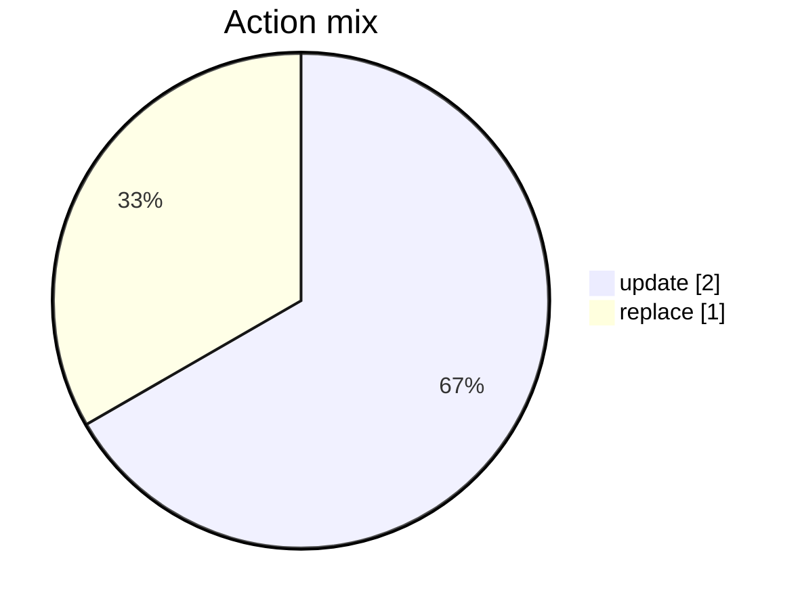
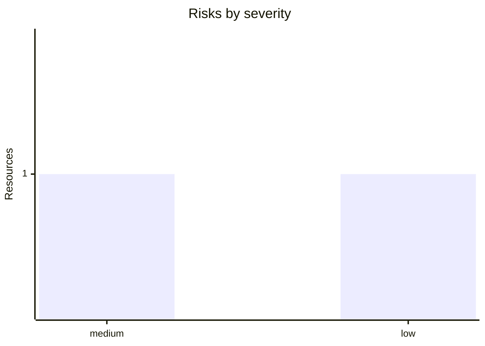
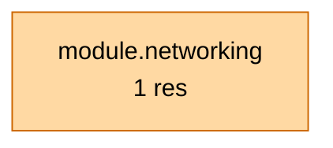

# Terraform Plan Summary

## AVM/ALZ plan report

_Terraform 1.9.0 · tfreport 1.0.0 · 2026-05-13T11:37:20+00:00_

**3 resource change(s)**: 0 create, 2 update, 0 delete, 1 replace.

## Dashboard

🟧 **3 change(s)** · 🟢 0 create · 🟡 2 update · 🔴 0 delete · 🟣 1 replace · ⚠️ 2 risk(s)

### Action mix

### Risk profile

### Impact heatmap

| Area | Resources | Load |
| --- | ---: | --- |
| Network & Connectivity | 1 | `████████████` |

## Executive summary

1 meaningful change(s) across 1 operational area(s) and 1 module(s).

_Posture: 2 low-signal update(s) were deprioritised_

### Reviewer focus

- Check outage risk and dependency sequencing for 1 destructive network change(s).

### Review first

- MEDIUM `module.networking.azurerm_subnet.app` (replace, `azurerm_subnet`) - Network resource replace/delete may cause connectivity outage.

### Impact by area

| Area | Resources | Actions | Risks | Example types |
| --- | ---: | --- | --- | --- |
| Network & Connectivity | 1 | 1 replace | 1M | `azurerm_subnet` |

### Module hotspots

| Module | Resources | Risks | Destructive | Example types |
| --- | ---: | --- | --- | --- |
| `module.networking` | 1 | 1M | 1 replace | `azurerm_subnet` |

#### Module map

### Noise budget

- Deprioritised below: 2 tag-only.

## Stats

| Metric | Count |
| --- | ---: |
| Create | 0 |
| Update | 2 |
| Delete | 0 |
| Replace | 1 |
| Read | 0 |
| No-op | 0 |

_Risks: 0 high, 1 medium, 1 low (advisory only)._

## Changes

### module.networking (1)

| Action | Resource | Type | Risk | Why |
| --- | --- | --- | --- | --- |
| `+/-` | `module.networking.azurerm_subnet.app` | `azurerm_subnet` | MEDIUM | replace because: `address_prefixes`; changed: `address_prefixes` |

Tag-only updates (2)

| Action | Resource | Type | Risk | Why |
| --- | --- | --- | --- | --- |
| `~` | `azurerm_resource_group.this` | `azurerm_resource_group` |  | changed: `tags` |
| `~` | `module.networking.azurerm_virtual_network.hub` | `azurerm_virtual_network` |  | changed: `tags` |

## Risks

- MEDIUM `module.networking.azurerm_subnet.app` (replace) - Network resource replace/delete may cause connectivity outage. _any-replace_

## Resource details

MEDIUM <code>module.networking.azurerm_subnet.app</code>

**Replace forced by:** `address_prefixes`
**Changed attributes:** `address_prefixes`

| Attribute | Before | After |
| --- | --- | --- |
| `address_prefixes` | `["10.0.1.0/24"]` | `["10.0.2.0/24"]` |

**List diff - `address_prefixes`:**
- added: `10.0.2.0/24`
- removed: `10.0.1.0/24`
**Risk rules:** _network-replace-or-delete_ (medium), _any-replace_ (low)

---
_Report generated by tfreport (advisory only). Open an issue to tune risk rules._
