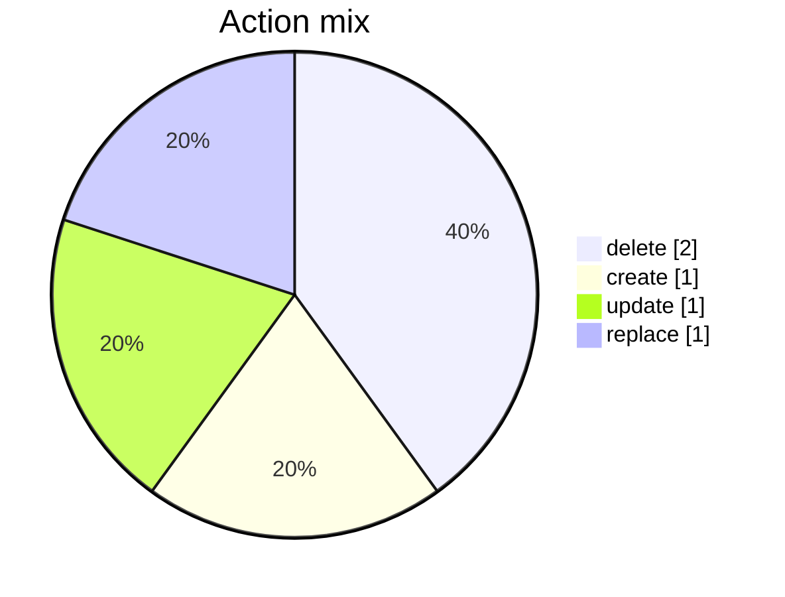
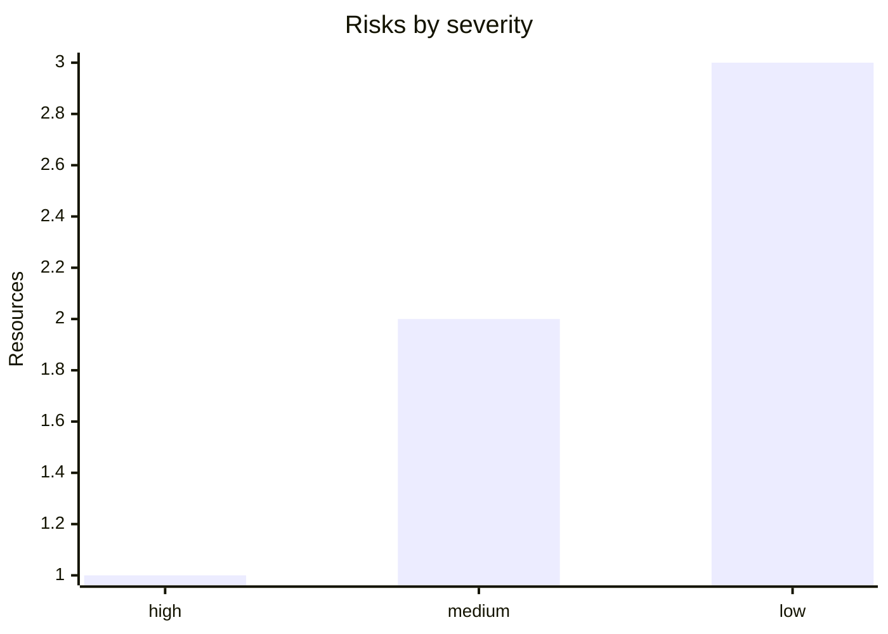
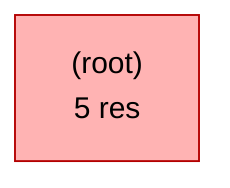

# Terraform Plan Summary

## Sample plan report

_Terraform 1.9.0 · tfreport 1.0.0 · 2026-05-13T11:37:11+00:00_

**5 resource change(s)**: 1 create, 1 update, 2 delete, 1 replace.

## Dashboard

🟥 **5 change(s)** · 🟢 1 create · 🟡 1 update · 🔴 2 delete · 🟣 1 replace · ⚠️ 6 risk(s)

### Action mix

### Risk profile

### Impact heatmap

| Area | Resources | Load |
| --- | ---: | --- |
| Data & Secrets | 1 | `██████` |
| Network & Connectivity | 2 | `████████████` |
| Identity & Access | 1 | `██████` |
| Platform & Control Plane | 1 | `██████` |

## Executive summary

5 meaningful change(s) across 4 operational area(s) and 1 module(s).

_Posture: 1 high-risk item(s) require explicit approval; 1 stateful replace/delete operation(s); 1 access-control change(s)_

### Reviewer focus

- Validate backup, migration, and rollback plans for 1 stateful replace/delete change(s).
- Review blast radius and least-privilege impact for 1 identity/authorisation change(s).
- Check outage risk and dependency sequencing for 1 destructive network change(s).

### Review first

- **HIGH** `azurerm_storage_account.data` (replace, `azurerm_storage_account`) - Replacement of a stateful resource will destroy data.
- MEDIUM `azurerm_role_assignment.reader` (delete, `azurerm_role_assignment`) - Identity/authorisation change - review blast radius.
- MEDIUM `azurerm_subnet.legacy` (delete, `azurerm_subnet`) - Network resource replace/delete may cause connectivity outage.
- `azurerm_resource_group.this` (create, `azurerm_resource_group`) - Targeted review recommended.
- `azurerm_virtual_network.hub` (update, `azurerm_virtual_network`) - Targeted review recommended.

### Impact by area

| Area | Resources | Actions | Risks | Example types |
| --- | ---: | --- | --- | --- |
| Data & Secrets | 1 | 1 replace | 1H | `azurerm_storage_account` |
| Network & Connectivity | 2 | 1 update, 1 delete | 1M | `azurerm_subnet`, `azurerm_virtual_network` |
| Identity & Access | 1 | 1 delete | 1M | `azurerm_role_assignment` |
| Platform & Control Plane | 1 | 1 create | - | `azurerm_resource_group` |

### Module hotspots

| Module | Resources | Risks | Destructive | Example types |
| --- | ---: | --- | --- | --- |
| `(root)` | 5 | 1H / 2M | 1 replace, 2 delete | `azurerm_resource_group`, `azurerm_role_assignment`, `azurerm_storage_account` |

#### Module map

## Stats

| Metric | Count |
| --- | ---: |
| Create | 1 |
| Update | 1 |
| Delete | 2 |
| Replace | 1 |
| Read | 0 |
| No-op | 0 |

_Risks: 1 high, 2 medium, 3 low (advisory only)._

## Changes

### (root) (5)

| Action | Resource | Type | Risk | Why |
| --- | --- | --- | --- | --- |
| `+/-` | `azurerm_storage_account.data` | `azurerm_storage_account` | **HIGH** |  |
| `-` | `azurerm_role_assignment.reader` | `azurerm_role_assignment` | MEDIUM |  |
| `-` | `azurerm_subnet.legacy` | `azurerm_subnet` | MEDIUM |  |
| `~` | `azurerm_virtual_network.hub` | `azurerm_virtual_network` |  |  |
| `+` | `azurerm_resource_group.this` | `azurerm_resource_group` |  |  |

## Risks

- **HIGH** `azurerm_storage_account.data` (replace) - Replacement of a stateful resource will destroy data. _any-replace_
- MEDIUM `azurerm_role_assignment.reader` (delete) - Identity/authorisation change - review blast radius. _any-delete_
- MEDIUM `azurerm_subnet.legacy` (delete) - Network resource replace/delete may cause connectivity outage. _any-delete_

---
_Report generated by tfreport (advisory only). Open an issue to tune risk rules._
